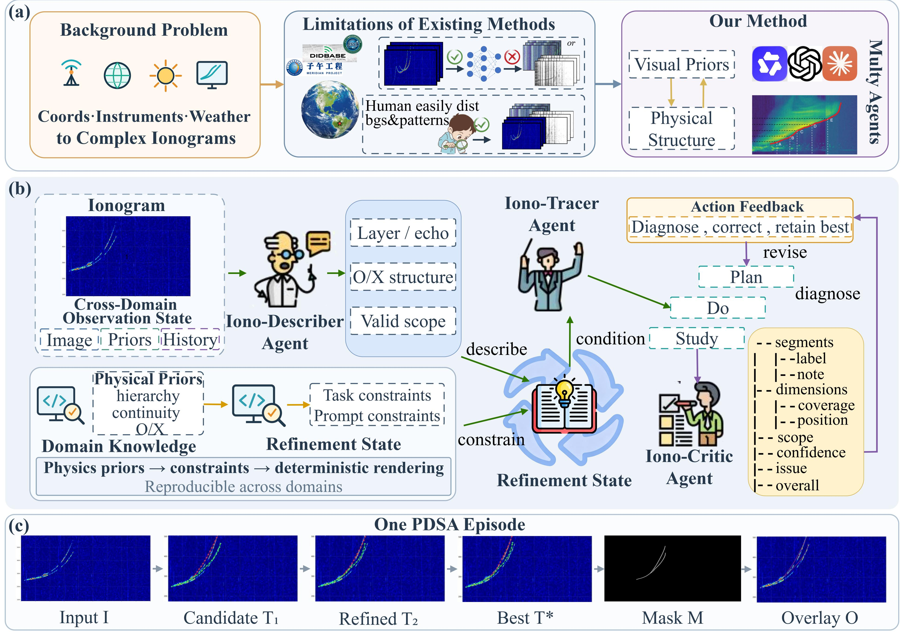
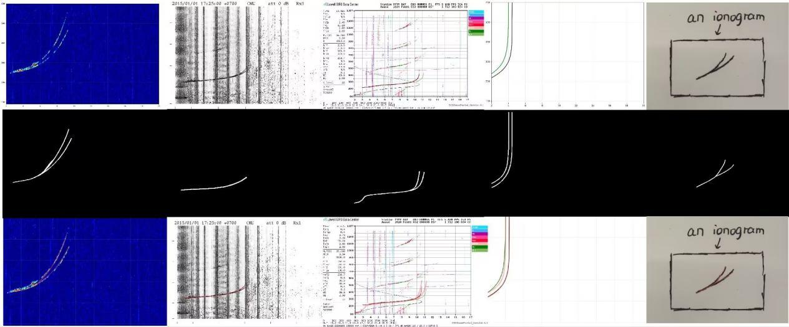

# ExAt Any Ionogram

**Zero-Shot Trace Extraction via Vision-Language Agents**

ExAt extracts F-layer first-hop echo traces from arbitrary ionograms with vision-language agents. No station-specific training: Iono-Describer, Iono-Tracer, and Iono-Critic run a physics-guided PDSA loop; MaskBuilder turns the best polyline into a binary mask.

## Pipeline

<p align="center">
  
</p>

Iono-Describer reads layer presence and O/X morphology. Iono-Tracer draws pixel polylines. Iono-Critic reviews the overlay and sends offsets back when needed. The loop keeps the best candidate.

## Demo

<p align="center">
  
</p>

Original ionogram, binary mask, and overlay across instruments, display styles, and stations.

## Install

```bash
pip install -r requirements.txt
set VLM_API_KEY=your-own-key
set VLM_BASE_URL=https://api.openai.com/v1
set VLM_MODEL=gpt-4o
```

Set these to your own OpenAI-compatible vision API.

## Usage

```bash
python run.py --image path/to/ionogram.png
python run.py --batch path/to/images/ --output-dir output
```

Each image writes `<output_dir>/<stem>/`:

- `<stem>_description.json`
- `<stem>_trace_iter{N}.json` / `<stem>_critic_iter{N}.json`
- `<stem>_mask.png` / `<stem>_overlay.png`
- `<stem>_result.json`

Copy this repository into `.cursor/skills/ionogram-scaling/` to use it as a Cursor Skill (`SKILL.md`).

## Citation

Zhang, S., Yang, S., Jiang, C., Wang, W., Yang, G., Zhao, Z., & Li, Y. (2026). ExAt any ionogram: Zero-shot trace extraction via vision-language agents. *Space Weather*. (Under review)

```bibtex
@article{zhang2026exat,
  title   = {ExAt Any Ionogram: Zero-Shot Trace Extraction via Vision-Language Agents},
  author  = {Zhang, Shuchang and Yang, Shiyu and Jiang, Chunhua and Wang, Wenxuan and Yang, Guobin and Zhao, Zhengyu and Li, Yujia},
  journal = {Space Weather},
  year    = {2026},
  note    = {Under review}
}
```

## License

MIT. See [LICENSE](LICENSE).
